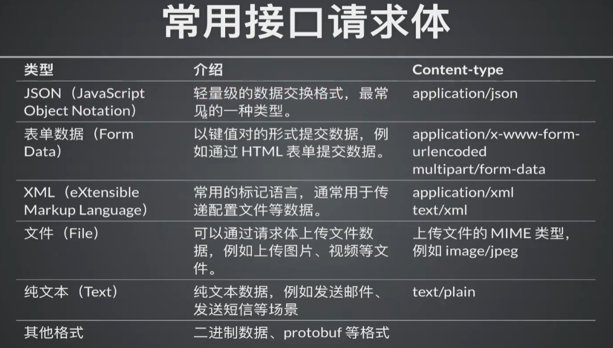

记录Python生态的测试技术，包括pytest, selenium, requests

1. 除开get以外的请求方法，其实也可以使用params参数，只是不太常用，因为这些请求方法的参数都是在请求体中传递的，而不是在url中传递的。
2. 
3. 生成allure测试报告指令：`pytest -vs 02-petstore.py --alluredir=./report --clean-alluredir`
4. 生成allure测试报告：`allure serve ./report`