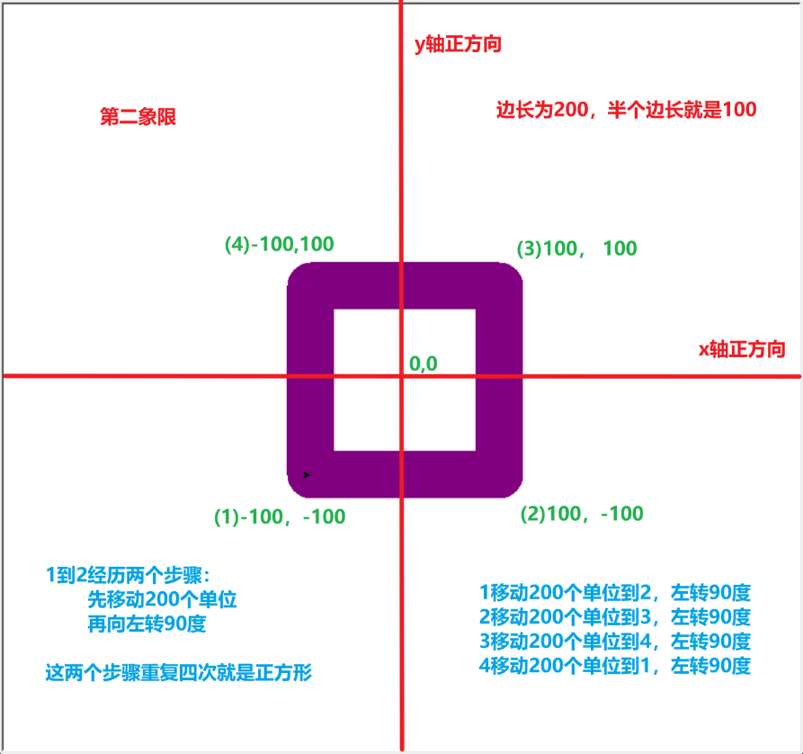

1. 目标：我们以红橙黄绿青蓝紫七种颜色，原地绘制七个正方形

2. 掌握技能：

   1. 数据结构-元组
   2. 循环结构
   3. 海龟库的使用

3. 实现步骤：

   1. 定义彩虹这种数据结构，红橙黄绿青蓝紫就对应七个英文单词，并且这些是相互关联的。那么换种说法就是，有一个长度为7个元素的序列

   ```python
   rainbow_color = ("red", "orange", "yellow", "green", "cyan", "blue", "purple")
   ```

   2. 怎么取出来序列里面的元素？在编程里面绝大多数起始值都是从0开始，我们要从哪里取？取第几个元素？以**red**为例，**red**是在**rainbow_color**这个序列里面的第**0**位元素，那么**red**就等价于**rainbow_color[0]**，**orange**就是**rainbow_color[1]**，**yellow**就是**rainbow_color[2]**，以此类推，**purple**就是**rainbow_color[6]**

   3. 设置画笔的粗细程度。在海龟库里，坐标体系是以窗口的中心为原点(0,0)的。向右为x轴的正方向，向上为y轴的正方向。这与我们在数学中常见的第一象限坐标体系是一样的。

   4. 绘制七遍正方形就要重复代码七遍吗？我们使用循环结构

   5. 绘制一次正方形流程：

      1. 先设置画笔的颜色

      2. 把画笔放置在右下角顶点（抬起和落下）

      3. 绘制四条边，四条边也是一种循环结构，只要是重复的都属于循环，一条边绘制流程：

         1. 海龟向前移200个单位==绘制一条200个像素的边长
         2. 海龟向左转90度==绘制直角了

         ```python
         # 循环绘制7个正方形，每个正方形的颜色不同|循环1
         for color_index in range(7):
             # 设置画笔颜色
             turtle.pencolor(rainbow_color[color_index])
             # 提起画笔并移动到新的位置
             turtle.penup()
             turtle.goto(x - 100, y - 100)
             # 放下画笔开始绘制
             turtle.pendown()
         
             # 绘制一个正方形， 四条边|循环2
             for _ in range(4):
                 # 向前移动200个像素, 也就是边长为200的正方形
                 turtle.forward(200)
                 # 向左转90度，向左转四次就回到原点
                 turtle.left(90)
         ```

         


4. 疑惑：

   1. 数据结构还有哪些？为什么使用元组来存储颜色

   1. 循环还有哪些？for循环是怎么实现的

   1. 海龟库还能做哪些事情？
   2. Python变量名命令规范
   3. 